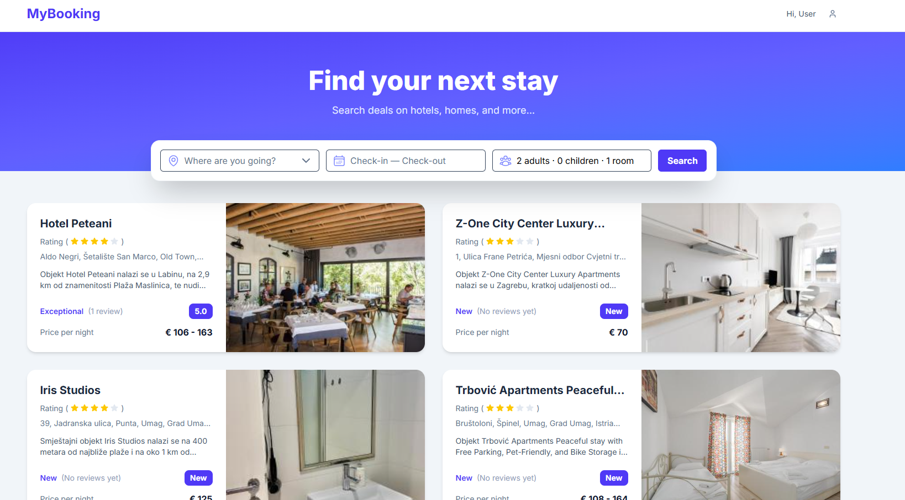
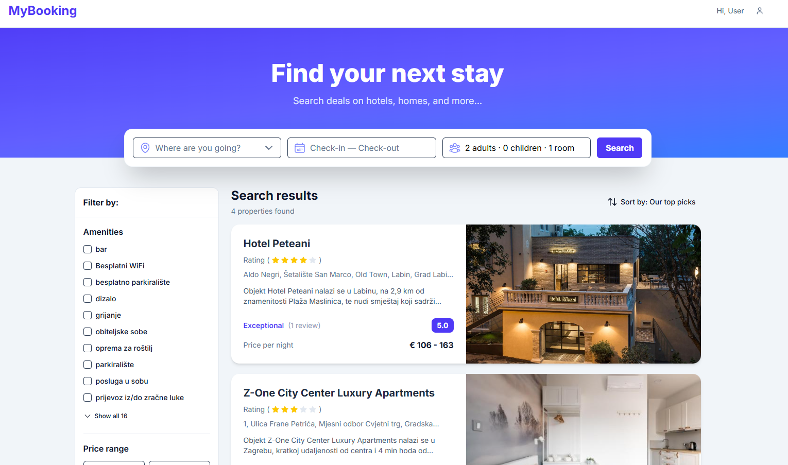
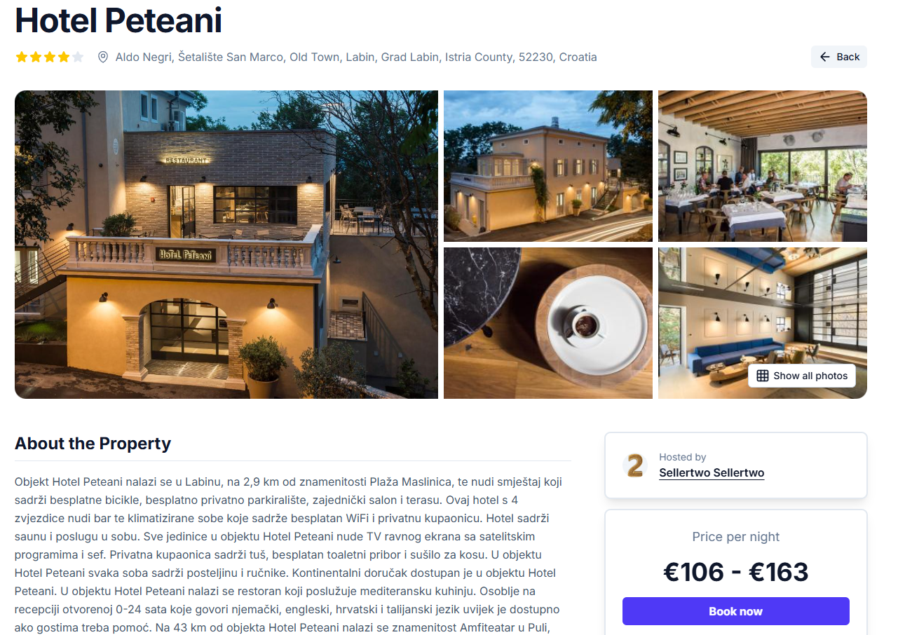
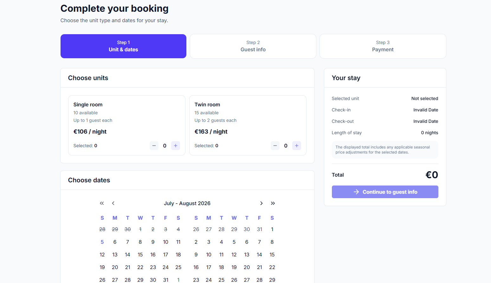
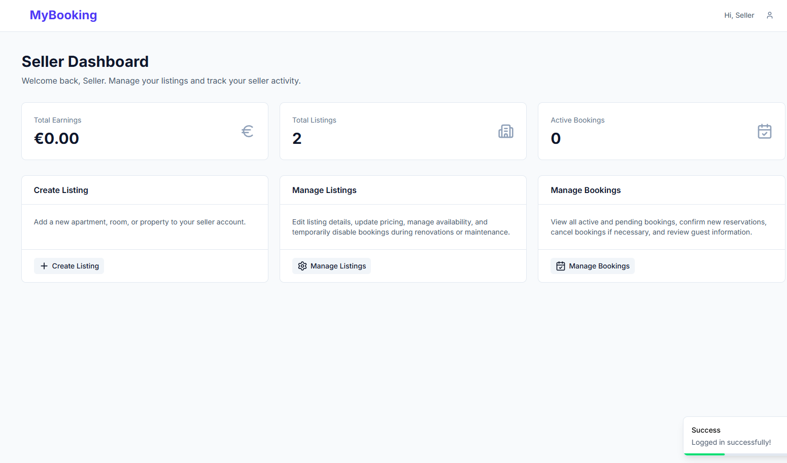
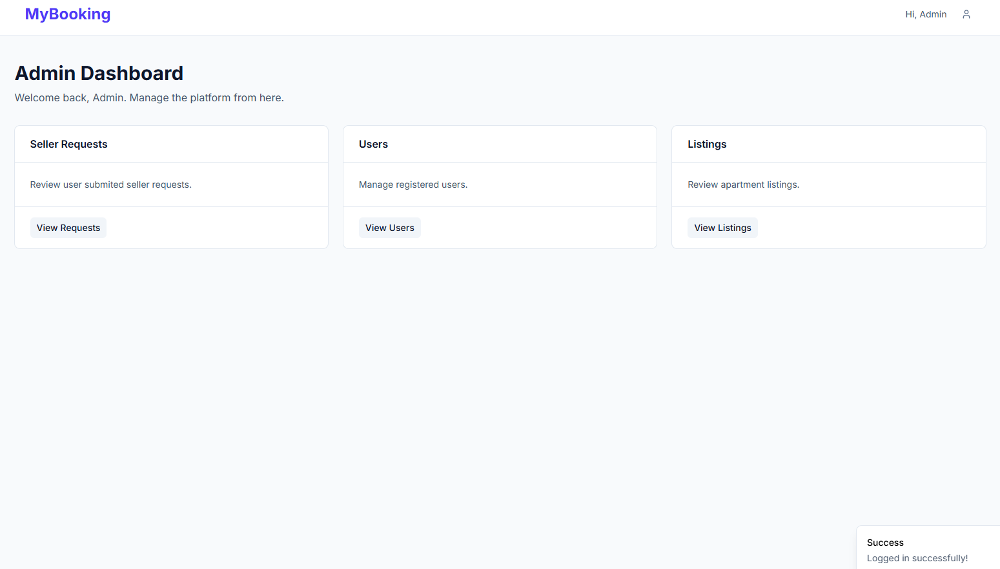
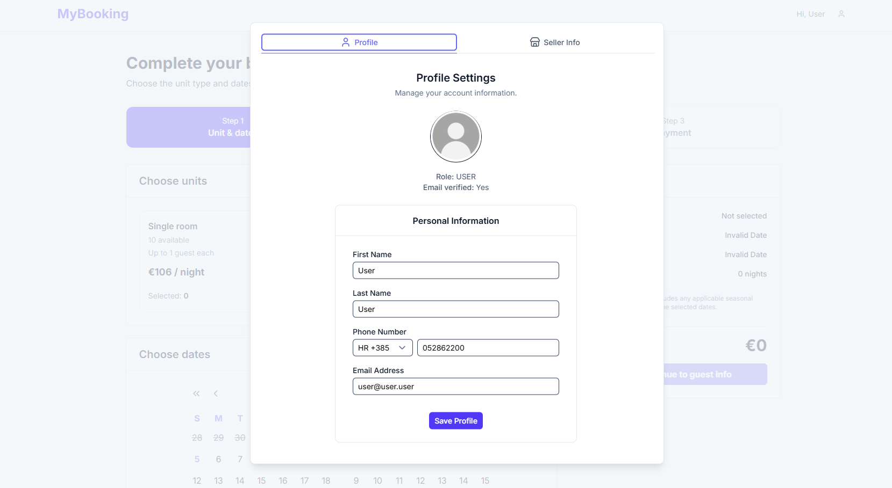

# 🏡 BookingApp

A full-stack accommodation booking platform inspired by Airbnb and Booking.com, built with **Spring Boot**, **Nuxt 4**, **PostgreSQL**, and **Docker**.

BookingApp allows users to discover accommodations, submit booking requests, manage listings as sellers, and review seller applications as administrators—all through a clean and responsive interface.

---

# ✨ Features

## 🔐 Authentication

- User registration & login
- JWT authentication using HTTP-only cookies
- Role-based authorization
  - 👤 User
  - 🏠 Seller
  - 🛡️ Admin

---

## 🏡 Listings

- Create, edit and delete listings
- Upload images via Cloudinary
- Multiple accommodation unit types
- Availability management
- Seasonal price adjustments
- Listing approval system

---

## 🔍 Smart Search

Search and filter listings by:

- 📍 Location
- 📅 Available dates
- 👨‍👩‍👧 Guests
- 🛏️ Rooms
- ⭐ Rating
- 💰 Price range
- 🏷️ Amenities
- 🏠 Seller
- ↕️ Sorting options

---

## 📖 Booking System

- Live availability checking
- Booking requests
- Booking approval & rejection
- Booking cancellation
- Guest information
- Payment information
- Booking history

---

## 🏠 Seller Dashboard

- Manage listings
- Manage bookings
- Seller statistics
- Availability overview

---

## 🛡️ Admin Dashboard

- Review seller applications
- Approve or reject listings
- Platform administration

---

## ❤️ Additional Features

- Favorite listings
- Reviews & ratings
- 🗺️ Interactive maps (Leaflet + OpenStreetMap)
- Responsive design
- Image galleries
- User profiles

---

# 🛠️ Tech Stack

## 🎨 Frontend

- Nuxt 4
- Vue 3
- TypeScript
- Nuxt UI
- Tailwind CSS
- Pinia
- Leaflet

## ⚙️ Backend

- Spring Boot
- Spring Security
- Spring Data JPA
- PostgreSQL
- JWT Authentication
- Gradle

## ☁️ External Services

- Cloudinary
- OpenStreetMap
- Nominatim Geocoding API

## 🐳 DevOps

- Docker
- Docker Compose
- DigitalOcean VPS

# 📸 Screenshots

## 🏠 Home page

---

## 🔍 Search results

---

## 🏡 Listing details

---

## 📅 Booking process

---

## 🏠 Seller dashboard

---

## 🛡️ Admin dashboard

---

## 🛡️ User profile

---

# 🔮 Future Improvements

- ✉️ Email verification
- 🔑 Password reset
- 💳 Stripe payments
- 🔔 Notifications
- 💬 Guest ↔ Seller messaging
- 📊 Advanced analytics
- 🛡️ Admin comment moderation
- 🌍 Multi-language support

---

# 👨‍💻 Author

**Andrej Korica**

Computer Science graduate passionate about full-stack development using Java, Spring Boot, Vue.js, and modern web technologies.

---

⭐ If you found this project interesting, consider giving it a star!